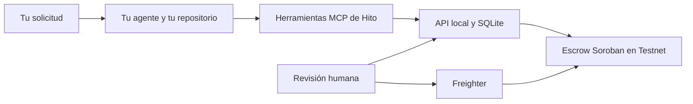

# Hito

**Acuerdos, hitos y evidencia desde tu agente de código, con pagos autorizados en Stellar Testnet.**

Pide a tu agente que convierta un encargo en resultados verificables. Hito conserva el plan, sus criterios, el progreso y las entregas entre sesiones. El agente usa el contexto de tu proyecto para planificar y desarrollar; tú revisas el acuerdo y autorizas las operaciones económicas.

Hito ofrece un servidor **MCP con siete herramientas**, una API HTTP local, una CLI y una interfaz de revisión. Funciona con clientes locales compatibles con MCP, incluidos Codex, Claude Code y Cursor. No necesitas una API de IA adicional ni subir tu repositorio a Hito.

## Stellar Odyssey Perú 2026

**Track recomendado:** Open Build / Wildcard — herramienta para desarrolladores que conecta agentes de código con acuerdos verificables y pagos autorizados en Stellar.

### Problema

Los agentes de código pueden planificar y producir software, pero el acuerdo económico suele quedar disperso entre chats, tareas y transferencias manuales. No existe una relación verificable entre lo acordado, la evidencia entregada, la aprobación humana y el pago. Darle una wallet directamente al agente tampoco es una solución segura.

### Solución

Hito añade una capa determinista entre el agente, las personas y Stellar. El agente usa herramientas MCP limitadas para guardar hitos, criterios, progreso y evidencia; las personas sellan el acuerdo y autorizan las operaciones con sus wallets; un contrato Soroban conserva las reglas económicas e impide cambiar silenciosamente importes, destinatarios o liberar dos veces el mismo pago.

### Construido durante la ventana del evento

- Servicio local en TypeScript con API HTTP, SQLite, CLI y siete herramientas MCP.
- Flujo de acuerdos versionados, evidencia ligada por hash e idempotencia durable.
- Contrato escrow Soroban con autoridades separadas, dependencias entre hitos, cancelación, vencimiento y protección contra doble liberación.
- Interfaz humana y bundle de Freighter para revisar y firmar transacciones Testnet.
- Pruebas automatizadas del núcleo, transporte MCP, Stellar SDK, contrato y navegador; los resultados y sus límites están en [Validación](docs/VALIDATION.md).

### Evidencia en Stellar Testnet

- [Transacción `create` confirmada en Testnet](https://stellar.expert/explorer/testnet/tx/1ff3b0c2ff51723cac49d8044ce0e3e7fbe44e9cc51f57c77fbb8eaec6c1e080) — ledger `4784176`.
- [Contrato Soroban desplegado en Testnet](https://stellar.expert/explorer/testnet/contract/CDYW3A7EM44O2SJCPMFM2GFYBJL5WFJD3TPAYQF6AMASQ3XXI64AHEQZ) — `CDYW3A7EM44O2SJCPMFM2GFYBJL5WFJD3TPAYQF6AMASQ3XXI64AHEQZ`.

La transacción anterior demuestra la creación on-chain de un acuerdo. El ciclo completo de financiación y liberación aún no tiene recibos publicados; no se presenta como completado. Consulta [gates pendientes](docs/REMAINING_GATES.md).



## Instalar y probar

Necesitas **Node.js 22.16 o superior**, npm y una copia de este repositorio. Rust, Stellar CLI y una wallet solo se necesitan para trabajar con el contrato o realizar operaciones Testnet. Los comandos siguientes se ejecutan desde la carpeta de Hito.

```bash
git clone https://github.com/NyroCode/hito-agent-native.git
cd hito-agent-native
npm ci
npm run setup
npm run build:wallet
npm run configure:agent
npm start
```

Mantén esa terminal abierta. En una segunda terminal, dentro de Hito:

```bash
npm run demo:seed
npm run doctor
```

Abre **http://127.0.0.1:8787**. Para la revisión humana, consulta personalmente `HITO_ADMIN_TOKEN` en el archivo local `.env` e introdúcelo en la interfaz. El agente utiliza exclusivamente `.hito-agent.env`. La UI conserva el token solo durante la sesión, sin guardarlo en el navegador.

La demo crea el proyecto `demo` y un borrador con importes y direcciones sintéticos. Puedes consultar el trabajo, registrar progreso, sellarlo desde la UI y practicar con evidencia. El modo local rechaza la construcción y el envío de transacciones; no hace falta wallet ni saldo.

`setup` nunca sobrescribe una instalación existente. Si ya tienes configuración, continúa con `npm start` y `npm run doctor`. Para usar otro puerto o preparar el acceso a un proyecto propio desde una instalación nueva:

```bash
npm run setup -- --projects demo,mi-proyecto --port 8788
```

Autorizar un identificador no registra el proyecto. La guía de [configuración](docs/CONFIGURATION.md) explica cómo registrarlo y cómo añadir acceso en una instalación existente.

## Conectar tu propio agente

`configure:agent` genera archivos con rutas absolutas a esta instalación, sin incluir valores de tokens:

| Cliente | Ejemplo generado | Destino en tu proyecto de código |
|---|---|---|
| Codex | `config/generated/codex.toml` | `.codex/config.toml` |
| Claude Code | `config/generated/claude-code.json` | `.mcp.json` |
| Cursor | `config/generated/cursor.json` | `.cursor/mcp.json` |

Incorpora únicamente la entrada `hito` si ya tienes otros servidores. Copia también la skill portable `config/generated/hito/` a la carpeta de skills correspondiente a tu cliente. La [guía de conexión](docs/AGENT_SETUP.md) indica los destinos, el procedimiento y cómo comprobar la llamada real. El backend debe seguir ejecutándose; el cliente inicia el proceso MCP por separado.

Desde tu agente, prueba:

> Usa Hito. Consulta los proyectos con `hito_get_context`, abre el proyecto `demo` y recupera su trabajo existente. Resume los hitos y registra una nota de progreso con la información real disponible. No crees otro trabajo igual.

Para un proyecto propio, registra primero sus partes y activo desde la interfaz y autoriza su identificador. Después:

> Usa Hito para el proyecto `mi-proyecto`. Lee su contexto y este repositorio. Quiero [resultado]. El presupuesto autorizado es [importe y activo] y el plazo es [fecha y zona horaria]. Revisa los trabajos existentes, propón hitos con criterios verificables y guarda el borrador cuando los datos estén completos.

El agente descubre proyectos y trabajos, recupera avances anteriores y relaciona las herramientas con tu solicitud. Si falta presupuesto, fecha o una decisión de alcance, debe preguntarte antes de persistir un acuerdo económico. En v0.1 todos los hitos requieren importe positivo; la planificación sin presupuesto queda en la conversación.

## Qué puedes hacer

| Herramienta | Operación |
|---|---|
| `hito_get_context` | Consultar proyectos, trabajos, progreso, entregas y solicitudes existentes. |
| `hito_save_work` | Crear o editar un borrador con criterios, dependencias e importes exactos. |
| `hito_update_progress` | Registrar avance, bloqueos y próximos pasos de un hito. |
| `hito_submit_delivery` | Vincular un artefacto y resultados `PASS`, `FAIL` o `NOT_CHECKED` al acuerdo. |
| `hito_check_readiness` | Comprobar qué evidencia falta para la revisión humana. |
| `hito_prepare_payment` | Preparar una solicitud económica para revisión y firma humana. |
| `hito_get_payment_status` | Consultar o reconciliar el estado de una solicitud existente. |

Los borradores tienen control de versiones y las escrituras admiten reintentos idempotentes. Un trabajo sellado es inmutable. El registro del proyecto, el sellado y la firma requieren autoridad humana. El agente no recibe herramientas para cambiar destinatarios o firmar transacciones.

El flujo de Testnet es: **crear acuerdo → proveedor acepta → pagador financia → proveedor presenta evidencia → pagador aprueba → liberar el pago**. Cada paso tiene sus permisos y confirmación. Sigue el [runbook Testnet](docs/TESTNET_RUNBOOK.md) con un proyecto nuevo y datos reales de esa red.

## Estado y límites

El núcleo local, el transporte MCP y el recorrido de instalación tienen pruebas automatizadas. Consulta [validación actual](docs/VALIDATION.md) y [gates pendientes](docs/REMAINING_GATES.md) para los resultados y sus límites. Una prueba de transporte no demuestra que todas las versiones de cada cliente hayan sido operadas interactivamente.

- La evidencia local es declarada; Hito no ejecuta ni certifica las pruebas de tu repositorio. `trusted_ci` sigue bloqueado hasta disponer de un verificador.
- Un informe listo para revisión no implica aceptación ni pago. Solo un resultado confirmado de la red acredita la operación correspondiente.
- La aplicación es local, de un operador y exclusivamente Testnet. No ofrece alojamiento multiusuario, arbitraje ni uso con fondos reales.
- La documentación conserva una creación de acuerdo Testnet reportada previamente; el ciclo completo con financiación, liberación y balances aún requiere evidencia. No se presenta como cerrado.

## Comandos de desarrollo

```bash
npm run check                 # Sintaxis
npm test                      # Dominio, HTTP, persistencia, permisos y setup
npm run check:types           # TypeScript
npm run test:adapters          # MCP, onboarding y criptografía SDK
npm run build:wallet          # Bundle de la interfaz Freighter
npm run test:browser          # Chromium; transporte wallet simulado
npm run verify:local -- --full --browser
```

`verify:local` guarda un informe nuevo en `reports/local-*/`, con comandos, resultados y lo no ejecutado. Los tests usan credenciales temporales propias. Para el contrato: `npm run contract:test` y `npm run contract:build`; consulta los [requisitos de desarrollo](CONTRIBUTING.md).

La CLI permite usar las mismas operaciones sin MCP:

```bash
npm run cli -- projects
npm run cli -- works demo
npm run cli -- help
```

## Documentación

- [Conectar Codex, Claude Code o Cursor](docs/AGENT_SETUP.md)
- [Configuración, proyecto propio y recuperación](docs/CONFIGURATION.md)
- [Recorrido local de principio a fin](docs/DEMO.md)
- [CLI y ejemplos de escrituras](docs/CLI.md)
- [Arquitectura](docs/ARCHITECTURE.md), [seguridad](docs/SECURITY.md) y [dependencias](docs/DEPENDENCIES.md)
- [Testnet y recibos](docs/TESTNET_RUNBOOK.md)
- [Contribuir y ejecutar pruebas](CONTRIBUTING.md)
- [Contrato REST](specs/001-hito-agent-native/contracts/api.openapi.json), [MCP](specs/001-hito-agent-native/contracts/mcp-tools.json) y [ABI Soroban](specs/001-hito-agent-native/contracts/escrow-abi.md)

El código se distribuye bajo [LICENSE](LICENSE). Las dependencias conservan sus licencias; consulta [NOTICE](NOTICE.md).
